# Android Studio安装过程

## 1.官网下载安装包

- [官网地址](https://developer.android.google.cn/studio)

1. 点击下载

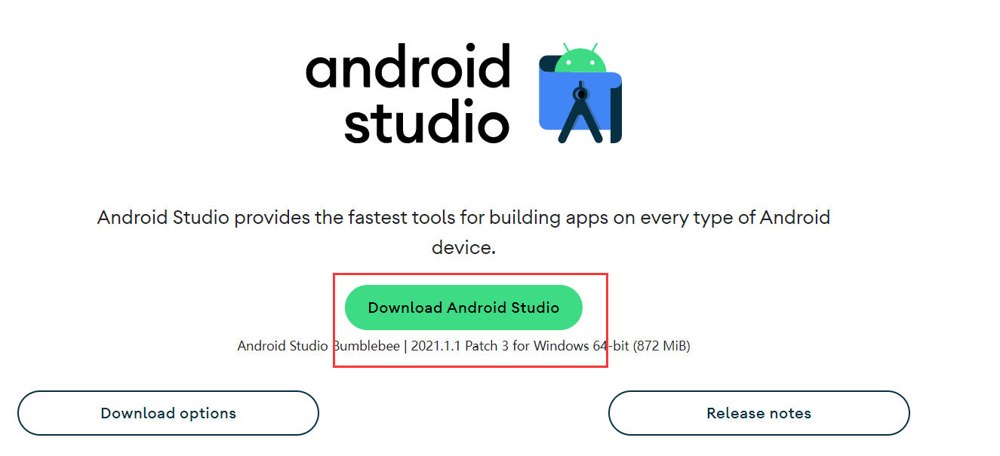

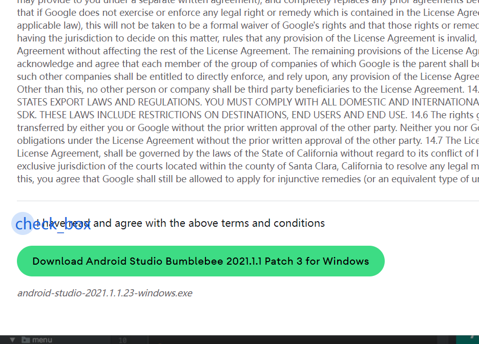

## 2.打开安装包

1. 一路点击next

2. 设置安装路径

   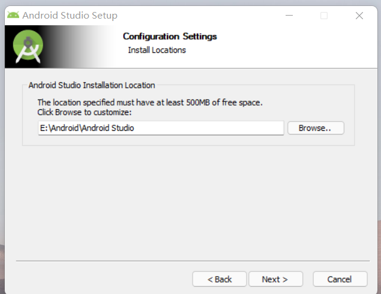

3. 完成安装并启动
   

## 3.进入Android Stuidio,创建第一个项目

1. 点击cancle
   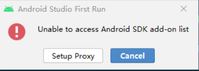
   
2. 安装SDK
   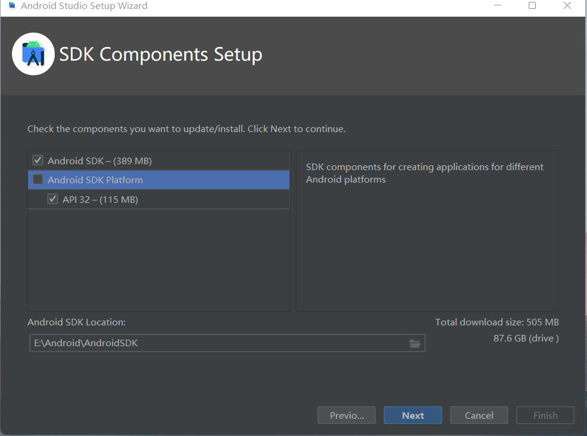
   
3. 安装完了以后就能进入了

4. 创建第一个项目，第一次需要下载gradle以及Android项目需要引用的包
   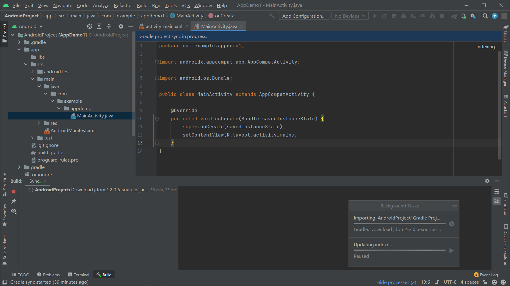
   
5. 由于我电脑上有雷电模拟器，此处以雷电模拟器作为虚拟机。

   - 点击桌面系统应用—>打开设置—>点击关于平板电脑，连续点击5次**版本号**–>会出现开发者选项—->进入开发者选项—->勾选usb调试。

   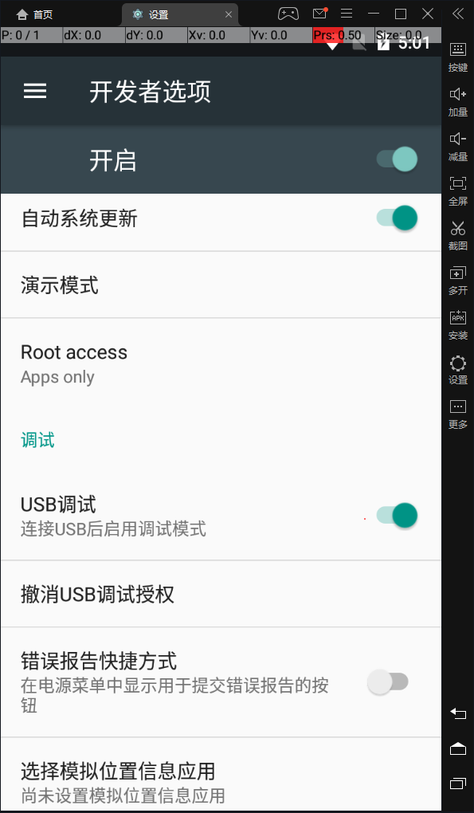

   - 按win+r，输入[cmd](https://so.csdn.net/so/search?q=cmd&spm=1001.2101.3001.7020)打开命令控制器，将目录切换到你安装雷电模拟器的文件夹下，我安装模拟器的目录如下：
     
   - 执行如下命令连接模拟器，注意端口号是5555，这是雷电模拟器的端口号
     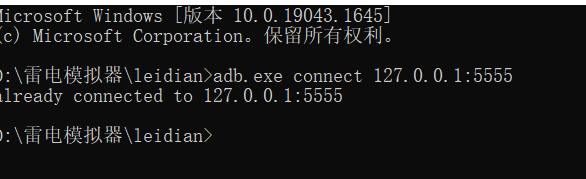
   - 在Androi Studio中运行项目
     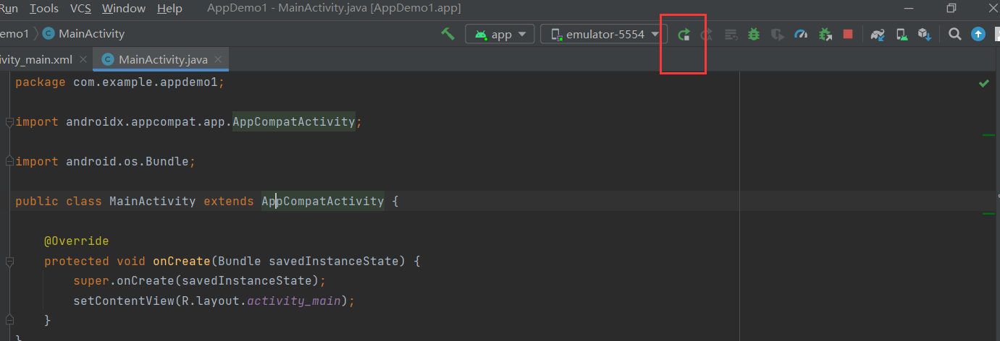
   - 模拟器中就会显示运行结果
     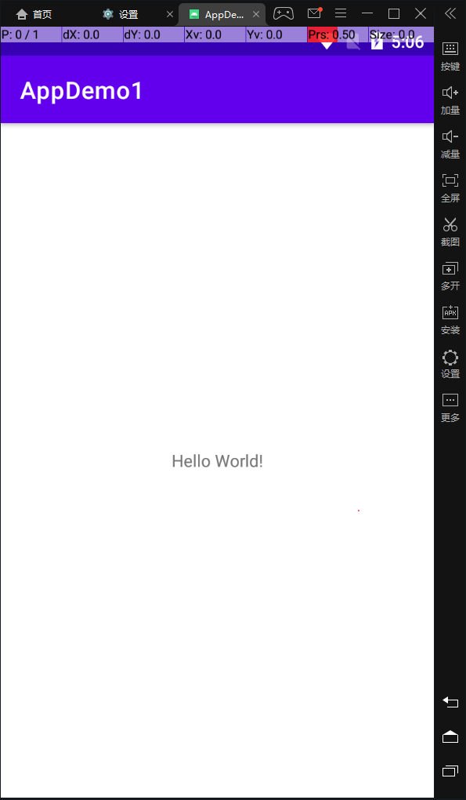

# Anaconda安装过程

## 1.官网下载安装包

- [官网地址](https://www.anaconda.com/products/distribution#macos)

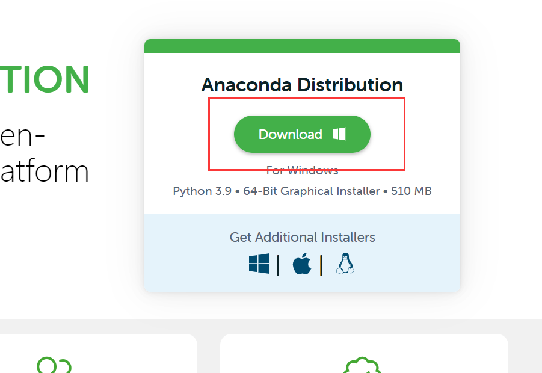

## 2.运行安装包

1. 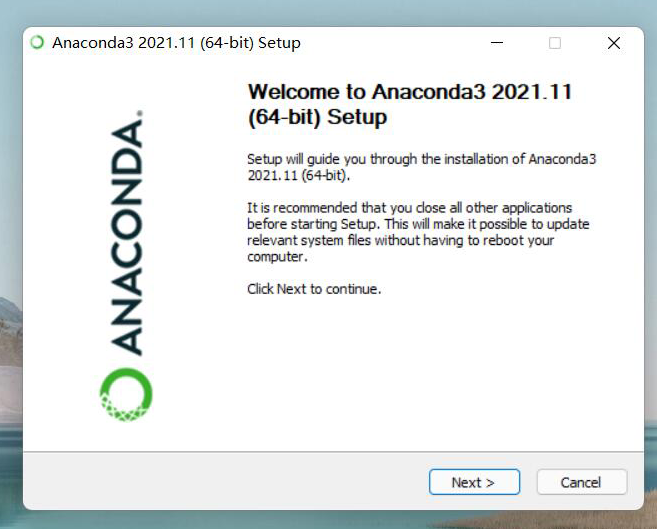
2. 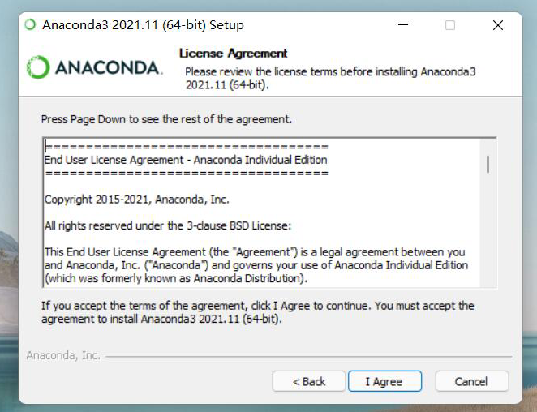
3. 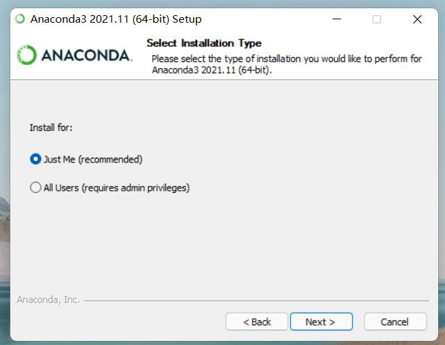
4. 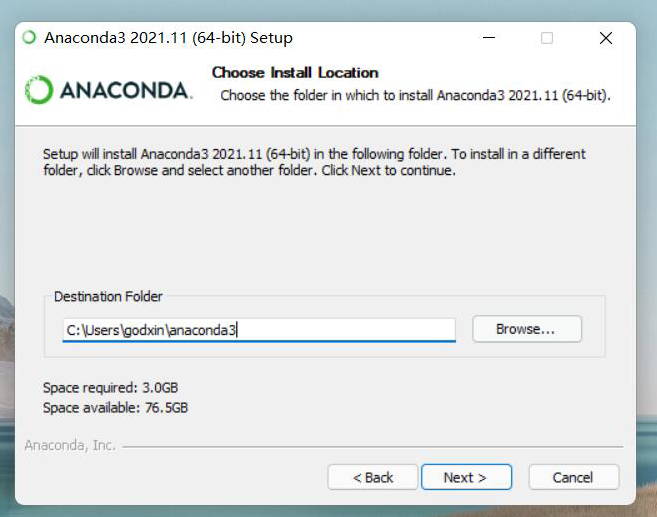
5. 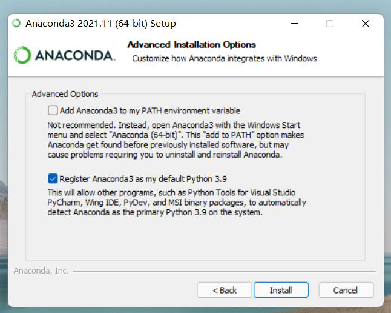
6. 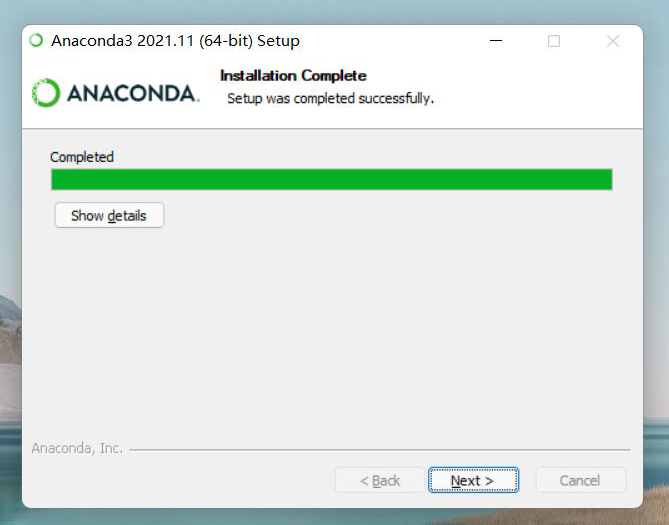
7. 至此，安装完成。

# 运行Jupyter NoteBook

## 1.打开Anaconda Navigator

- 点击运行Jupyter NoteBook

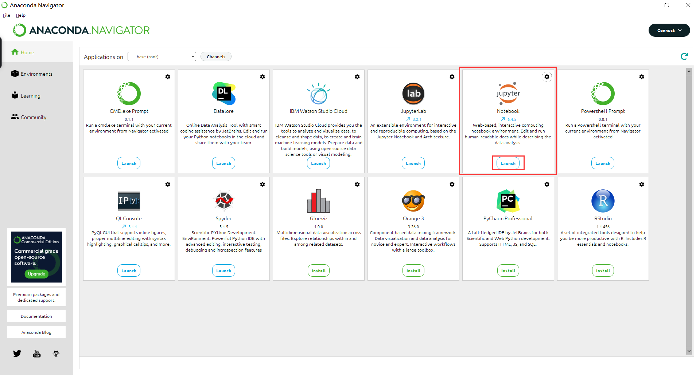

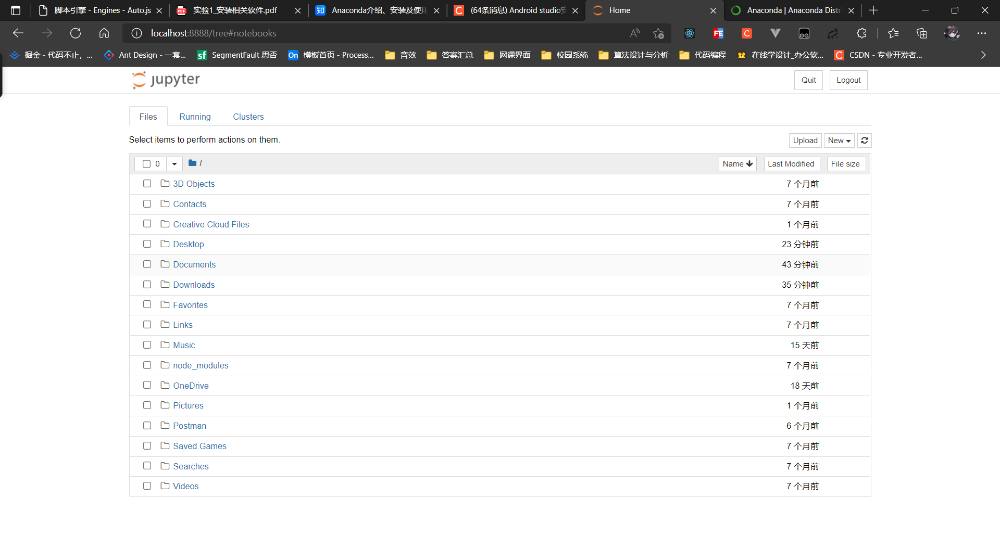

## 2.修改Jupter NoteBook打开时候的默认路径

1. 右键Jupter NoteBook 打开属性
   

2. 在属性栏中修改起始位置和目标， 目标中原来有个参数，**一定要把目标后面的参数%USERPROFILE%替换掉**

   此处改为桌面路径为例
   

3. 重新打开Jupter NoteBook，发现初始路径就变成桌面了
   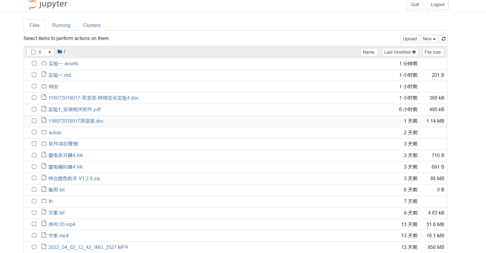

## 3.新建一个Notebook（Python 3），查看界面布局，并尝 试写一些文本和代码。

1. 点击新建
   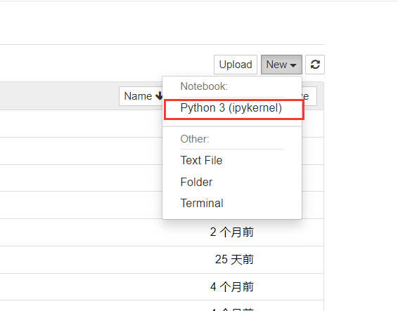

2. 进入到了一个空白python 3
   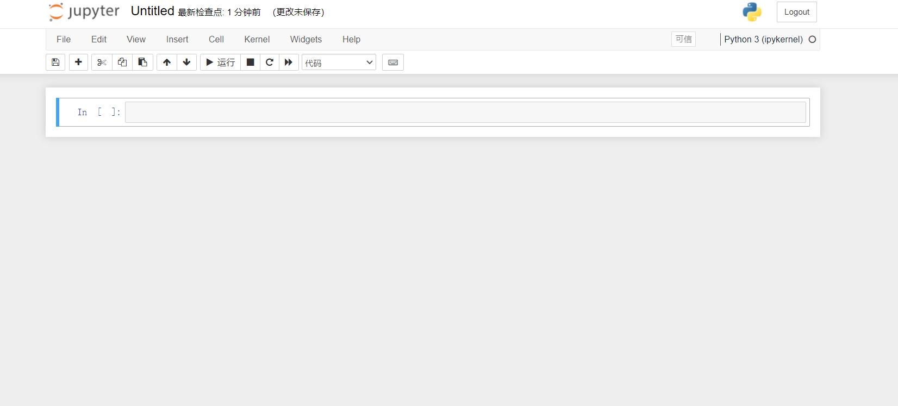

3. 就可以在各个cell中进行编码了。
   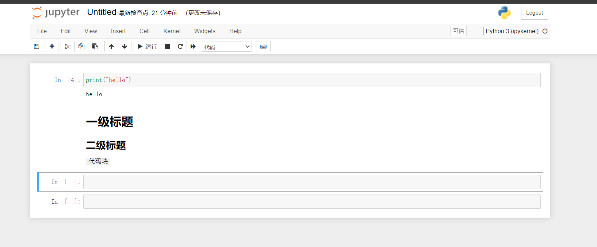
