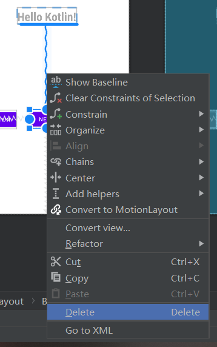
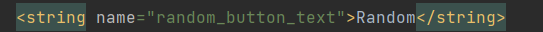
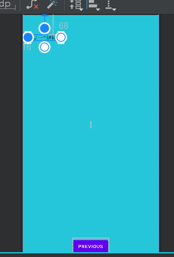

# 1.创建第一个Kotlin应用程序

1. 打开Android Studio，选择Projects>New Project，然后选择Basic Activity.
   
2. 在模拟器上运行程序，我是用雷电模拟器作为虚拟机运行，具体怎么运行在实验一中已经说明了。
   

# 2.查看布局编辑器

1. 查看res>layout>fragment_first.xml，查看布局的代码（Code），修改Textview的**Text**属性。

2. 查看布局的代码（Code），修改Textview的Text属性，

   ```
   android:text="@string/hello_first_fragment"
   ```

   右键该代码，选择Go To > Declaration or Usages，跳转到values/strings.xml，看到高亮文本

   ```
   <string name="hello_first_fragment">Hello first fragment</string>
   ```

   修改字符串属性值为“Hello Kotlin!”。
   

更进一步，修改字体显示属性，在Design视图中选择**textview_first**文本组件，在Common Attributes属性下的textAppearance域，设置相关的文字显示属性，


重新运行应用程序，查看显示效果。可以看到 已经成功修改了


# 3.向页面添加更多的布局

## 1.添加按钮和约束

1. 从Palette面板中拖动Button到
   

2. 调整Button的约束，设置Button的Top>BottonOf textView，
   

3. 添加button的约束
   

4. 修改Button的id
   

## 2.调整Next按钮

1. 删除约束
   

2. 添加新约束，Next的Top约束至TextView的底部，TextView的底部约束至屏幕的底部。
   

3. 更改组件的文本
   找到toast_button按钮的text属性部分，点击左边的灯泡
   
   弹出对话框，令资源名为toast_button_text，资源值为Toast，并点击OK。
   

4. 更新Next按钮
   在属性面板中更改Next按钮的id，从button_first改为random_button。
   
   在string.xml文件，右键**next**字符串资源，选择 **Refactor > Rename**，

   
   修改资源名称为**random_button_text**，点击**Refactor** 。
   

   随后，修改**Next**值为**Random**。
   

   ## 3.添加第三个按钮

   1. 添加新按钮，并且给其添加四个方向的约束
      
   2. 完善UI组件的属性设置
      更改新增按钮id为**count_button**
      
      显示字符串为**Count**
      
   3. 对应的字符串资源为count_button_text
      
   4. 运行测试结果
      

## 3.更新按钮和文本框的外观

1. 添加新颜色
   往color.xml中添加
   

2. 设置组件的外观
   fragment_first.xml的属性面板中设置屏幕背景色为

   ```
   android:background="@color/screenBackground"
   ```

3. 设置每个按钮的背景色为**buttonBackground**

   ```
   android:background="@color/buttonBackground"
   ```

   测试结果：
   

## 4.设置组件的位置

1. Toast与屏幕的左边距设置为24dp，Random与屏幕的右边距设置为24dp，利用属性面板的Constraint Widget完成设置。
   
2. 设置TextView的垂直偏移为0.3
   

3. 最终展示结果如下：
   

# 4.添加代码完成应用程序交互

## 1.设置代码自动补全

1. Android Studio中，依次点击File>New Projects Settings>Settings for New Projects…，查找Auto Import选项，在Java和Kotlin部分，勾选Add Unambiguous Imports on the fly。
   

## 2.TOAST按钮添加一个toast消息

1. 打开FirstFragment.kt文件，有三个方法：onCreateView，onViewCreated和onDestroyView，在onViewCreated方法中使用绑定机制设置按钮的响应事件（创建应用程序时自带的按钮）。

   ```
   binding.randomButton.setOnClickListener {
       findNavController().navigate(R.id.action_FirstFragment_to_SecondFragment)
   }
   ```

2. 接下来，为TOAST按钮添加事件，使用**findViewById()**查找按钮id，代码如下：

   ```
   // find the toast_button by its ID and set a click listener
   view.findViewById<Button>(R.id.toast_button).setOnClickListener {
      // create a Toast with some text, to appear for a short time
      val myToast = Toast.makeText(context, "Hello Toast!", Toast.LENGTH_LONG)
      // show the Toast
      myToast.show()
   }
   ```

3. 使Count按钮更新屏幕的数字

   ```
   view.findViewById<Button>(R.id.count_button).setOnClickListener {
      countMe(view)
   }
   
   
   
   private fun countMe(view: View) {
      // Get the text view
      val showCountTextView = view.findViewById<TextView>(R.id.textview_first)
   
      // Get the value of the text view.
      val countString = showCountTextView.text.toString()
   
      // Convert value to a number and increment it
      var count = countString.toInt()
      count++
   
      // Display the new value in the text view.
      showCountTextView.text = count.toString()
   }
   ```

4. 测试count按钮效果：
   

# 5.完成第二界面的代码

## 1.更改Second Fragment的背景色为**screenBackground2**

1. 在colors.xml中添加代码
2. 在fragment_second.xml中添加代码

3. 效果测试：

## 2.previous置于屏幕的底部

1. 删去previous的上方约束
   

2. 效果展示

## 3.屏幕的顶部放置一个TextView，设置相关外观属性，显示提示信息

1. 添加TextView控件并且设置约束，调整位置

2. 修改Id

3. 在Strings.xml中定义字符串作为该TextVIew控件的文本!
   

4. 代码如下：

   ```
       <TextView
           android:id="@+id/textview_header"
           android:layout_width="0dp"
           android:layout_height="wrap_content"
           android:layout_marginStart="24dp"
           android:layout_marginTop="24dp"
           android:layout_marginEnd="24dp"
           android:text="@string/random_heading"
           android:textColor="@color/colorPrimaryDark"
           android:textSize="24sp"
           app:layout_constraintEnd_toEndOf="parent"
           app:layout_constraintHorizontal_bias="1.0"
           app:layout_constraintStart_toStartOf="parent"
           app:layout_constraintTop_toTopOf="parent" />
   ```

   

## 4.屏幕的中间放置一个TextView，设置相关外观属性，显示随机数字

​	再fragment_second.xml中添加如下代码：

```
<TextView
   android:id="@+id/textview_random"
   android:layout_width="wrap_content"
   android:layout_height="wrap_content"
   android:text="R"
   android:textColor="@android:color/white"
   android:textSize="72sp"
   android:textStyle="bold"
   app:layout_constraintBottom_toTopOf="@+id/button_second"
   app:layout_constraintEnd_toEndOf="parent"
   app:layout_constraintStart_toStartOf="parent"
   app:layout_constraintTop_toBottomOf="@+id/textview_second"
   app:layout_constraintVertical_bias="0.45" />

```

## 5.启用SafeArgs

- 这是一个 gradle 插件，它可以帮助您在导航图中输入需要传递的数据信息，作用类似于Activity之间传递数据的Bundle。

1. 首先打开 **Gradle Scripts > build.gradle (Project:AndroidProject)**

2. 在plugins节添加

   ```
   id 'androidx.navigation.safeargs.kotlin' version '2.5.0-alpha01' apply false
   ```

3. module部分在plugins节添加

   ```
   id 'androidx.navigation.safeargs'
   ```

4. 重新生成工程**Build > Make Project**

## 6.创建导航动作的参数

打开导航栏，在SecondFragment的属性栏添加新参数myArg


## 7.FirstFragment添加代码，向SecondFragment发数据

FirstFragment.kt中修改onViewCreated()方法

```
            val showCountTextView = view.findViewById<TextView>(R.id.textview_first)
            val currentCount = showCountTextView.text.toString().toInt()
            val action = FirstFragmentDirections.actionFirstFragmentToSecondFragment(currentCount)
            findNavController().navigate(action)
```

## 8.添加SecondFragment的代码

1. 导入navArgs包

   ```
   import androidx.navigation.fragment.navArgs
   ```

2. `onViewCreated()`代码之前添加一行

   ```
   val args: SecondFragmentArgs by navArgs()
   ```

3. 修改onViewCreated方法：

   ```
       override fun onViewCreated(view: View, savedInstanceState: Bundle?) {
           super.onViewCreated(view, savedInstanceState)
   
           //在`onViewCreated()`中获取传递过来的参数列表，提取**count**数值，并在**textview_header**中显示
           val count = args.myArg
           val countText = getString(R.string.random_heading, count)
           view.findViewById<TextView>(R.id.textview_header).text = countText
   
           //根据count值生成随机数
           val random = java.util.Random()
           var randomNumber = 0
           if (count > 0) {
               randomNumber = random.nextInt(count + 1)
           }
   
           //textview_random中显示count值
           view.findViewById<TextView>(R.id.textview_random).text = randomNumber.toString()
   
           binding.buttonSecond.setOnClickListener {
               findNavController().navigate(R.id.action_SecondFragment_to_FirstFragment)
           }
       }
   ```

   

结果展示：


至此，完成了实验二所需功能。