# 1.下载初始代码

- 使用git clone命令克隆仓库

  ```
  git clone https://github.com/hoitab/TFLClassify.git
  ```

  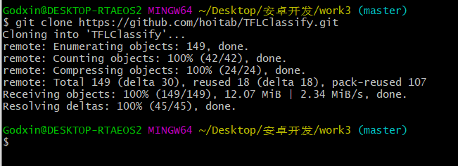

# 2.运行初始项目

1. 打开克隆下来的项目
   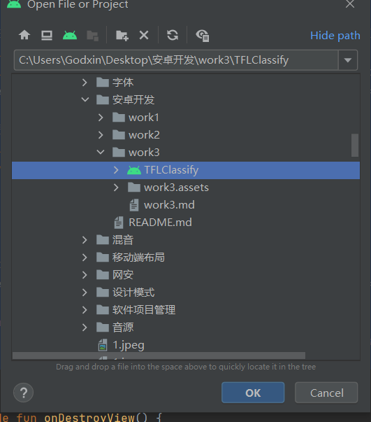

2. 修改版本配置
   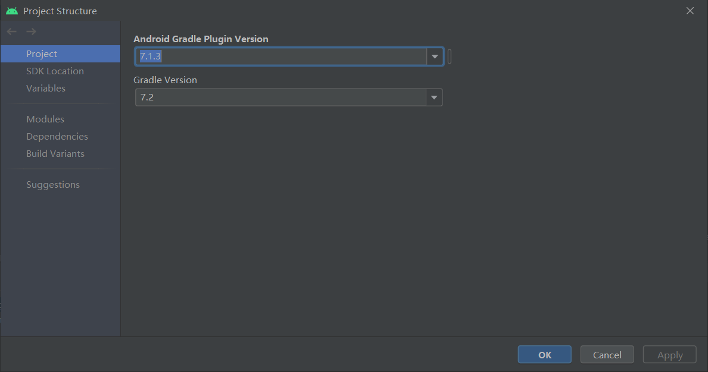

3. 加载项目插件

# 3.向应用中添加TensorFlow Lite

1. 右键“start”模块，或者选择File，然后New>Other>TensorFlow Lite Model

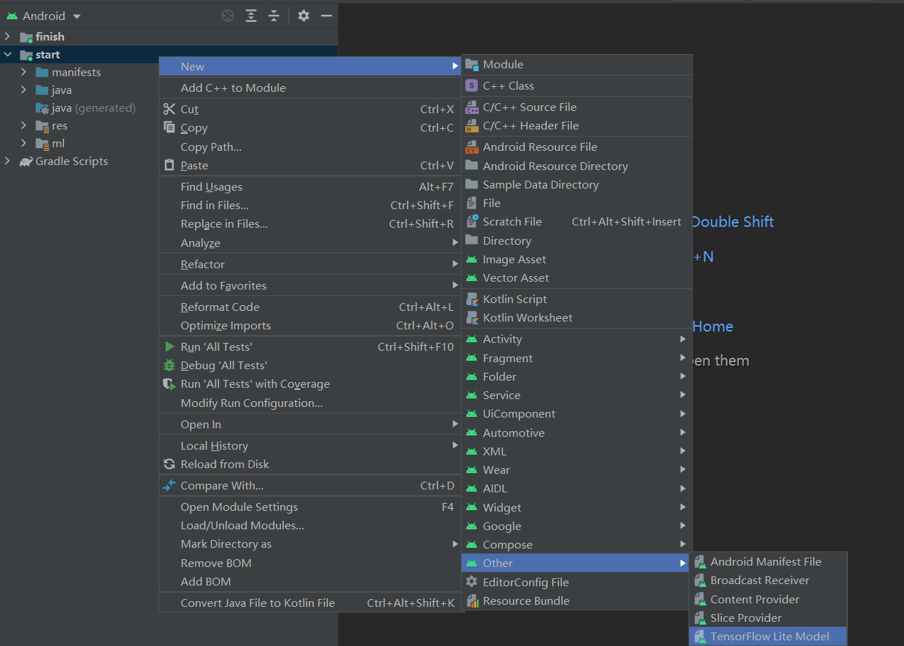

2. 选择finish模块中的文件
   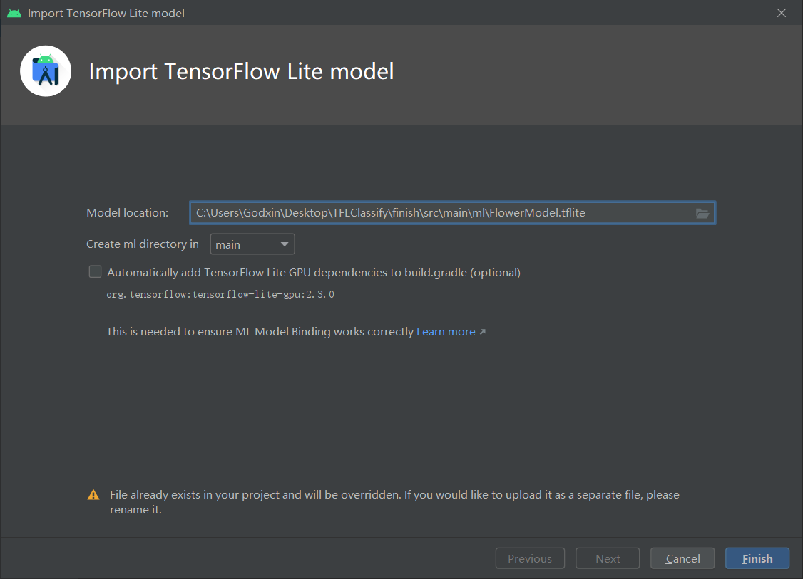

3. 最终TensorFlow Lite模型被成功导入，并生成摘要信息
   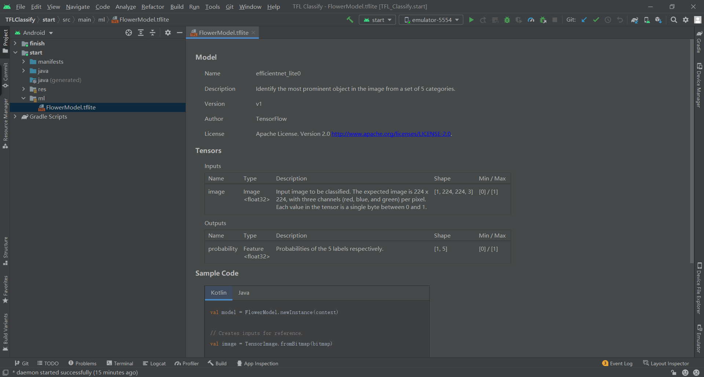

## 检查代码中的TODO项

1. 打开todu列表视图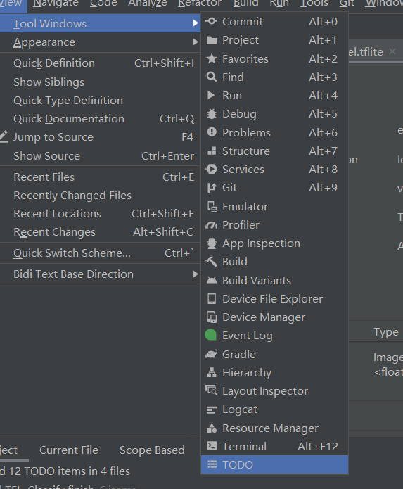

2. group by modules
   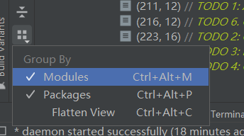

3. 可以看到视图如下：
   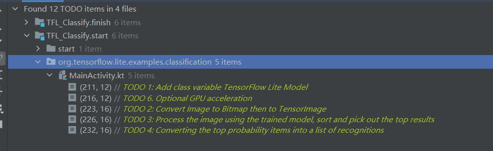

## 添加代码重新运行APP

1. 定位“start”模块**MainActivity.kt**文件的TODO 1，添加初始化训练模型的代码

   ```
   private class ImageAnalyzer(ctx: Context, private val listener: RecognitionListener) :
           ImageAnalysis.Analyzer {
   
     ...
     // TODO 1: Add class variable TensorFlow Lite Model
     private val flowerModel = FlowerModel.newInstance(ctx)
   
     ...
   }
   ```

   

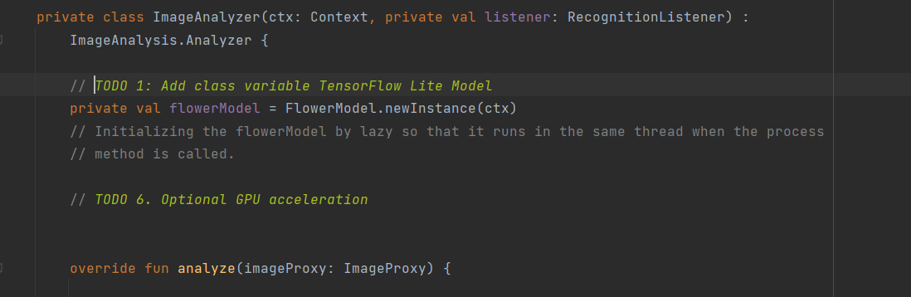

2. 在CameraX的analyze方法内部，需要将摄像头的输入`ImageProxy`转化为`Bitmap`对象，并进一步转化为`TensorImage` 对象

   ```
   override fun analyze(imageProxy: ImageProxy) {
     ...
     // TODO 2: Convert Image to Bitmap then to TensorImage
     val tfImage = TensorImage.fromBitmap(toBitmap(imageProxy))
     ...
   }
   ```

   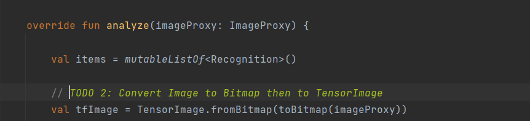

3. 对图像进行处理并生成结果，主要包含下述操作：

   ```
   按照属性score对识别结果按照概率从高到低排序
   列出最高k种可能的结果，k的结果由常量MAX_RESULT_DISPLAY定义
   
   override fun analyze(imageProxy: ImageProxy) {
     ...
     // TODO 3: Process the image using the trained model, sort and pick out the top results
     val outputs = flowerModel.process(tfImage)
         .probabilityAsCategoryList.apply {
             sortByDescending { it.score } // Sort with highest confidence first
         }.take(MAX_RESULT_DISPLAY) // take the top results
   
     ...
   }
   ```

   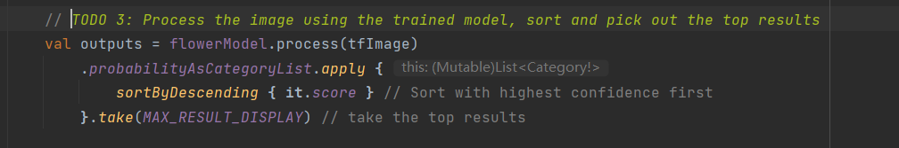

4. 将识别的结果加入数据对象`Recognition` 中，包含`label`和`score`两个元素。后续将用于`RecyclerView`的数据显示

   ```
   override fun analyze(imageProxy: ImageProxy) {
     ...
     // TODO 4: Converting the top probability items into a list of recognitions
     for (output in outputs) {
         items.add(Recognition(output.label, output.score))
     }
     ...
   }
   
   ```

   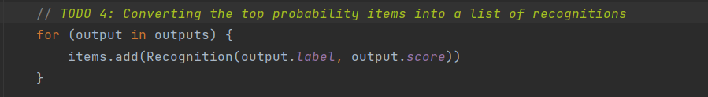

5. 将原先用于虚拟显示识别结果的代码注释掉或者删除

   ```
   // START - Placeholder code at the start of the codelab. Comment this block of code out.
   for (i in 0..MAX_RESULT_DISPLAY-1){
       items.add(Recognition("Fake label $i", Random.nextFloat()))
   }
   // END - Placeholder code at the start of the codelab. Comment this block of code out.
   
   ```

   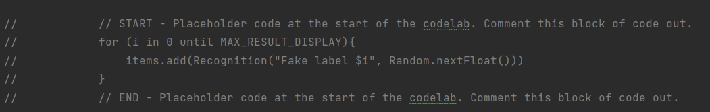

6. 以物理设备重新运行start模块

7. 测试结果：

   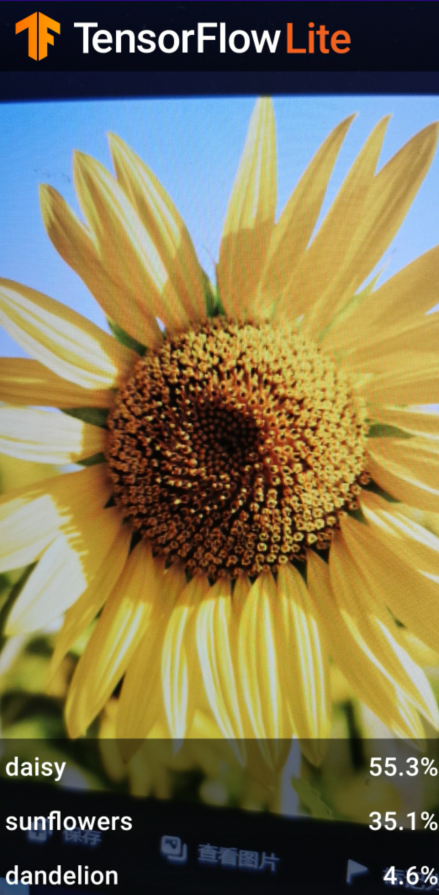

   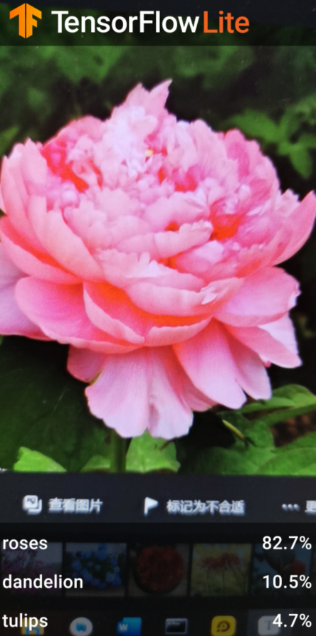

