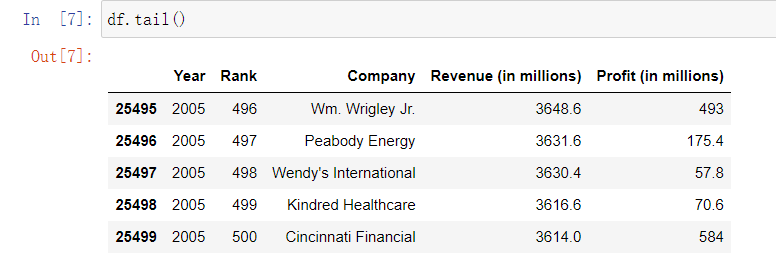
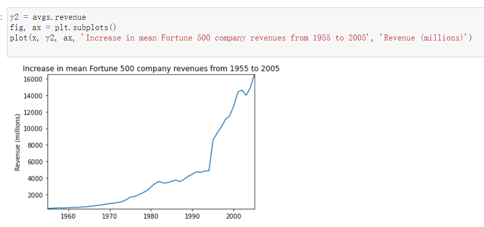

# 简单的Python程序的例子

# 数据分析的例子

选择排序案例

```
# 选择排序法
def selection_sort(arr):
    # 己算列表长度
    n = len(arr)
    for i in range(n - 1):
        # 将起始元素设为最小元素
        min_index = i
        for j in range(i + 1, n):
            if arr[j] < arr[min_index]:
                min_index = j
        arr[min_index], arr[i] = arr[i], arr[min_index]
array = [33, 511, 99 , 313, 23, 15, 67, 562,11]
print("原列表：")
print(array)
selection_sort(array)
print("排序后的列表：")
print(array)
```


## 设置

1. 导入相关工具库

   ```
   %matplotlib inline
   import pandas as pd
   import matplotlib.pyplot as plt
   import seaborn as sns
   ```

2. 加载数据集

   ```
   df = pd.read_csv('fortune500.csv')
   ```

## 检查数据集

```
df.head()
```


```
df.tail()
```


对数据属性列进行重命名，以便在后续访问

```
df.columns = ['year', 'rank', 'company', 'revenue', 'profit']
```

检查数据是否完整


检查属性列的类型。

对于profit属性，期望的结果是float类型，因此其可能包含非数字的值，利用正则表达式进行检查。

profit这一列为字符串，统计一下到底存在多少条这样的记录。

使用直方图显示一下按照年份的分布情况。

单独年份这样的记录数都少于25条，即少于4%的比例。这在可以接受的范围内，因此删除这些记录。

```
df = df.loc[~non_numberic_profits]
df.profit = df.profit.apply(pd.to_numeric)
```

在检查记录条目数

```
len(df)
```


```
df.types
```


可见，上述操作已经达到清洗无效数据记录的效果。


## 使用matplotlib进行绘图

1. 以年分组绘制平均利润和收入。首先定义变量和方法。

   ```
   group_by_year = df.loc[:, ['year', 'revenue', 'profit']].groupby('year')
   avgs = group_by_year.mean()
   x = avgs.index
   y1 = avgs.profit
   def plot(x, y, ax, title, y_label):
       ax.set_title(title)
       ax.set_ylabel(y_label)
       ax.plot(x, y)
       ax.margins(x=0, y=0)
   
   ```

2. 开始绘图

   ```
   fig, ax = plt.subplots()
   plot(x, y1, ax, 'Increase in mean Fortune 500 company profits from 1955 to 2005', 'Profit (millions)')
   ```

   

3. 看起来像指数增长，但是1990年代初期出现急剧的下滑，对应当时经济衰退和网络泡沫。再来看看收入曲线。
   

4. 对数据结果进行标准差处理。

   ```
   def plot_with_std(x, y, stds, ax, title, y_label):
       ax.fill_between(x, y - stds, y + stds, alpha=0.2)
       plot(x, y, ax, title, y_label)
   fig, (ax1, ax2) = plt.subplots(ncols=2)
   title = 'Increase in mean and std Fortune 500 company %s from 1955 to 2005'
   stds1 = group_by_year.std().profit.values
   stds2 = group_by_year.std().revenue.values
   plot_with_std(x, y1.values, stds1, ax1, title % 'profits', 'Profit (millions)')
   plot_with_std(x, y2.values, stds2, ax2, title % 'revenues', 'Revenue (millions)')
   fig.set_size_inches(14, 4)
   fig.tight_layout()
   ```

   

5. 可见，不同公司之间的收入和利润差距惊人，那么到底前10%和后10%的公司谁的波动更大了？此外，还有很多有价值的信息值得进一步挖掘。

# 分享Notebooks

1. 点击"Kernel > Restart & Run All"
   这样做的目的使得Notebook不含有中间的执行结果，按照代码执行的顺序，产生稳定的结果。

2. 导出notebooks
   使用"File > Download as"可以以多种格式导出Notebooks，例如：html, pdf, markdown文档等。

